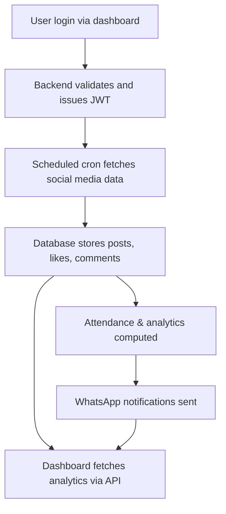

# Cicero Business Process
*Last updated: 2025-06-25*

This document summarizes the high level business processes of the Cicero platform, which consists of two main components: the **Cicero_V2** backend and the **Cicero_Web** dashboard.

## 1. Client & User Management

1. Administrator accesses the dashboard (Cicero_Web) and logs in using their WhatsApp number and `client_id`.
2. Through the dashboard or API endpoints (`/clients`, `/users`), the admin can register new client organizations and add user accounts associated with each client.
3. User data can also be imported in bulk from a Google Sheet using the backend's import service.

## 2. Social Media Data Collection

1. Cron jobs in Cicero_V2 run throughout the day to fetch Instagram and TikTok posts via RapidAPI.
2. Fetched posts, profiles, likes, and comments are saved into the PostgreSQL database and cached in Redis.
3. The system matches likes and comments with registered users to generate attendance reports.

## 3. Dashboard Analytics

1. The dashboard queries the backend for analytic summaries (`/dashboard/*`, `/insta/*`, `/tiktok/*`).
2. Clients can view daily engagement data, user directories, and post histories for their social media accounts.
3. Results are normalized by the backend so the dashboard receives consistent JSON structures.

## 4. Notifications & Reporting

1. Scheduled jobs generate recap reports of likes and comments each day.
2. Reports are automatically sent to administrators via WhatsApp using the `waService` module.
3. Admins can also trigger manual fetches or report generation by sending specific WhatsApp commands.

## 5. Queue Processing

1. For heavy workloads, Cicero_V2 can publish tasks to RabbitMQ queues.
2. Worker processes consume the queues and update the database asynchronously, keeping the dashboard responsive.

## 6. Overall Flow

The business process begins with client onboarding and continues with automated collection of social media metrics, attendance checks, and delivery of reports. Administrators interact mainly through the Next.js dashboard while the backend orchestrates data retrieval, persistence, and messaging tasks.

Refer to [docs/naming_conventions.md](naming_conventions.md) for code style guidelines.
