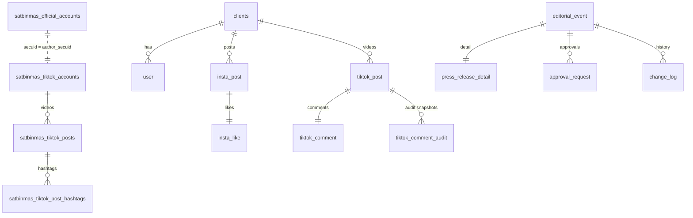

# Database Structure

*Last updated: 2026-04-30*

This document describes the main tables inside Cicero_V2 and their relationships.
The SQL schema is located at [sql/schema.sql](../sql/schema.sql) and is designed
for PostgreSQL but can work with MySQL or SQLite via the DB adapter.

## Table Overview

| Table Name | Purpose |
|------------|---------|
| clients | master table for registered organisations |
| satbinmas_official_accounts | Satbinmas official handles plus metadata linked to a client |
| satbinmas_official_media | Daily Instagram media snapshots for Satbinmas Official accounts |
| user | members belonging to a client |
| roles / user_roles | role catalogue and pivot for users |
| dashboard_user | login credentials for dashboard access |
| dashboard_user_clients | mapping between dashboard users and permitted clients |
| dashboard_user_subscriptions | premium tier history and cache source for dashboard logins |
| dashboard_premium_request | dashboard premium submissions with payment proof and expiry |
| dashboard_premium_request_audit | audit trail for dashboard premium request lifecycle |
| penmas_user | credentials for Penmas editorial operators |
| insta_post / insta_post_khusus | Instagram posts fetched for each client (regular & khusus feeds) |
| insta_like / insta_comment | cached likes and comments for Instagram posts |
| insta_profile | basic Instagram profile information |
| insta_post_roles | restricts Instagram post visibility per role |
| tiktok_post / tiktok_post_roles | TikTok videos and their role restrictions |
| tiktok_comment | cached TikTok comments |
| satbinmas_tiktok_accounts / satbinmas_tiktok_posts / satbinmas_tiktok_post_hashtags | TikTok secUid snapshots for Satbinmas automation (separate from legacy `tiktok_post`) |
| instagram_user / instagram_user_metrics | extended Instagram account data |
| ig_ext_* tables | RapidAPI references for detailed Instagram metadata |
| visitor_logs | record of API access |
| tasks | outstanding assignments for users versus posts |
| link_report / link_report_khusus | links submitted from the mobile app (regular & khusus) |
| editorial_event | Penmas editorial events |
| press_release_detail | extended press-release information for an editorial event |
| approval_request | approval workflow for editorial events |
| change_log | mutation history for editorial events |
| premium_request | premium subscription requests |
| login_log | history of login events |
| saved_contact | Google People API cache used for WhatsApp messaging |

## Tables

### `clients`
Represents each organisation using the system.
- `client_id` – primary key
- `nama` – organisation name
- `client_type` – text description of the type
- `client_status` – boolean, active or not
- `client_insta` / `client_tiktok` – usernames of the client accounts
- `client_operator`, `client_group`, `tiktok_secuid`, `client_super` – optional metadata
- `regional_id` – regional scope identifier (e.g. `JATIM`)
- `parent_client_id` – optional parent client reference for hierarchy (nullable, and older deployments may not have the column until the regional scoping migration is applied)
- `client_level` – hierarchy level (e.g. `mabes`, `polda`, `direktorat`, `satker`)

Official Satbinmas accounts for each client are stored in the dedicated
`satbinmas_official_accounts` table described below so that operators can manage
per-platform handles—along with display names, profile links, and verification
state—without mutating legacy `client_*` columns.

#### Regional scoping & hierarchy (Polda Jatim)
Migration `sql/migrations/20251222_regionalScopingJatim.sql` standardises the
initial regional scope for existing data with the following rules:
- All existing `clients` rows are assigned `regional_id = 'JATIM'`.
- The Polda Jatim client is ensured to exist as `client_id = 'POLDA_JATIM'` with
  `client_level = 'polda'`.
- Directorate and satker clients in the Jatim region (`client_level` or
  `client_type` in `direktorat`/`satker`) are linked via
  `parent_client_id = 'POLDA_JATIM'`.
- Any users already associated to the Polda Jatim client are normalised to the
  `POLDA_JATIM` client id so `user.client_id` remains valid.

### `user`
Holds users belonging to a client.
- `user_id` – primary key (NRP/NIP string)
- `nama`, `title`, `divisi` – user info fields
- `insta`, `tiktok` – social media handles
- `whatsapp` – digits-only contact number normalized to the `62` prefix (min 8 digits, no `@c.us` suffix stored)
- `desa` – desa binaan for Ditbinmas users
- `email` – optional, validated during OTP flows
- `client_id` – foreign key referencing `clients(client_id)`
- `status` – boolean flag
- `premium_status` – boolean flag indicating active subscription
- `premium_end_date` – date the premium access expires
- `created_at`, `updated_at` – timestamps managed by the database trigger
- roles are assigned through the `user_roles` pivot table

### `roles`
Stores available role names.
- `role_id` – serial primary key
- `role_name` – unique role identifier

### `user_roles`
Pivot table linking users to roles.
- `user_id` – references `user(user_id)`
- `role_id` – references `roles(role_id)`
- composite primary key `(user_id, role_id)`

### `penmas_user`
Dedicated credential store for Penmas editorial accounts.
- `user_id` – primary key
- `username` – unique login identifier
- `password_hash` – bcrypt hash
- `role` – textual role label (e.g. `editor`, `validator`)
- `created_at`, `updated_at`

### `dashboard_user`
Credentials for the web dashboard login.
- `dashboard_user_id` – primary key generated with `gen_random_uuid()`
- `username` – unique login name
- `password_hash` – bcrypt hashed password
- `role_id` – foreign key referencing `roles(role_id)`
- `status` – boolean indicating whether the account is active
- `whatsapp` – digits-only contact number normalized to the `62` prefix (min 8 digits, no `@c.us` suffix stored)
- `created_at`, `updated_at` – timestamps
- legacy `user_id` references have been removed; `dashboard_user_id` is the sole
  identifier for dashboard flows.

### `dashboard_user_clients`
Link table assigning dashboard accounts to the clients they can view.
- `dashboard_user_id` – references `dashboard_user(dashboard_user_id)`
- `client_id` – references `clients(client_id)`
- composite primary key `(dashboard_user_id, client_id)`

### `dashboard_user_subscriptions`
Premium subscription ledger for dashboard logins. Each row represents a tier
interval and feeds the cached premium columns in `dashboard_user`.
- `subscription_id` – UUID primary key generated with `gen_random_uuid()`
- `dashboard_user_id` – references `dashboard_user(dashboard_user_id)` with
  cascade delete so history is removed when the account is dropped
- `tier` – subscription tier label (`basic`, `pro`, `enterprise`, etc.)
- `status` – current state (`active`, `pending`, `canceled`, `expired`)
- `started_at` – start timestamp (defaults to `NOW()`)
- `expires_at` – expiration timestamp for the interval
- `canceled_at` – optional cancellation timestamp
- `metadata` – JSONB payload for provider or payment evidence (e.g. invoice ID)

Index `idx_dashboard_user_subscriptions_user_status_expires` accelerates queries
that fetch the latest active record per user. When a subscription is renewed,
service code updates `dashboard_user.premium_status`, `premium_tier`, and
`premium_expires_at` from the most recent active interval so login responses
can attach premium context without scanning historical rows.

### `insta_post`
Stores Instagram posts fetched for a client.
- `shortcode` – primary key of the post
- `client_id` – foreign key to `clients`
- `caption` – post text
- `comment_count` – number of comments
- `thumbnail_url` – image preview
- `is_video` – boolean whether post is a video
- `video_url` – link to video file if any
- `image_url` – link to image file
- `images_url` – JSON array of all image URLs when the post is a carousel
- `is_carousel` – boolean indicating whether the post contains multiple images
- `created_at` – timestamp of the post

### `insta_post_khusus`
Stores curated Instagram posts for khusus audiences.
- Same columns as `insta_post`
- Independent primary key (`shortcode`) to allow separate scheduling

### `insta_like`
List of users who liked an Instagram post.
- `shortcode` – primary key and foreign key to `insta_post(shortcode)`
- `likes` – JSON array of usernames
- `updated_at` – when the like data was fetched

### `insta_comment`
Cached comments for an Instagram post.
- `shortcode` – primary key and foreign key to `insta_post(shortcode)`
- `comments` – JSON array of comment payloads
- `updated_at`
- Some deployments may not yet have this table; cleanup routines skip deletion when
  the table is absent.

### `insta_post_roles`
Restricts `insta_post` visibility by role.
- `shortcode` – references `insta_post(shortcode)` with cascade delete
- `role_name` – role allowed to view the post
- composite primary key `(shortcode, role_name)`

### `insta_profile`
Profile information for arbitrary Instagram accounts.
- `username` – primary key
- `full_name`, `biography`, `follower_count`, `following_count`,
  `post_count`, `profile_pic_url`, `updated_at`

### `tiktok_post`
Data for TikTok videos associated with a client.
- `video_id` – primary key
- `client_id` – foreign key to `clients`
- `caption`, `like_count`, `comment_count`, `created_at`

### `tiktok_post_roles`
Restricts TikTok post visibility by role.
- `video_id` – references `tiktok_post(video_id)` with cascade delete
- `role_name` – permitted role name
- composite primary key `(video_id, role_name)`

### `tiktok_comment`
Comments for a TikTok video.
- `video_id` – primary key and foreign key to `tiktok_post(video_id)` with cascade
  delete to remove cached comments when the source post is deleted
- `comments` – JSON array of comments
- `updated_at`

### `tiktok_comment_audit`
Historical snapshots of usernames that commented on a TikTok video.
- `audit_id` – serial primary key
- `video_id` – references `tiktok_post(video_id)` with cascade delete so audit rows
  are cleaned up automatically when a post is removed
- `usernames` – JSON array of normalized usernames at capture time
- `snapshot_window_start`, `snapshot_window_end` – window boundaries recorded per
  snapshot
- `captured_at` – timestamp when the snapshot was saved

### `satbinmas_tiktok_accounts`
Snapshots of TikTok profiles keyed by `secUid` so Satbinmas fetches can persist
account metrics without touching the legacy `tiktok_post` table.
- `author_secuid` – primary key (TikTok `secUid`); joinable to
  `satbinmas_official_accounts.secuid` when present
- `author_id` – optional TikTok author identifier from RapidAPI payloads
- `username` – unique handle (case-insensitive index)
- `display_name` – nickname or display name
- `bio` – author biography/signature
- `avatar_url` – profile picture URL
- `is_verified`, `is_private` – boolean flags
- `followers`, `following`, `likes_total`, `video_count` – aggregate metrics
- `snapshot_at` – timestamp marking when the profile snapshot was taken

### `satbinmas_tiktok_posts`
TikTok video snapshots linked to `satbinmas_tiktok_accounts(author_secuid)` via the
native `secUid`. This table is designed for the new Satbinmas TikTok crawler and
does **not** reuse the older `tiktok_post` rows bound to `client_id`.
- `post_id` – primary key (TikTok video ID)
- `author_secuid` – foreign key to `satbinmas_tiktok_accounts(author_secuid)` with cascade
  delete
- `caption`, `language` – textual metadata
- `created_at` – video creation timestamp parsed from RapidAPI responses
- `play_url`, `cover_url` – media URLs
- `duration_sec`, `height`, `width`, `ratio` – media attributes
- `views`, `likes`, `comments`, `shares`, `bookmarks` – engagement metrics
- `is_ad`, `is_private_post`, `share_enabled`, `duet_enabled`, `stitch_enabled`
  – boolean flags for the post
- `crawl_at` – timestamp of the fetch job writing the snapshot

### `satbinmas_tiktok_post_hashtags`
Stores hashtags extracted from `satbinmas_tiktok_posts` captions. Case-insensitive
uniqueness prevents duplicates per `post_id`.
- `post_id` – references `satbinmas_tiktok_posts(post_id)` with cascade delete
- `hashtag` – raw hashtag text (without the `#` prefix)

### `tasks`
Stores assignments of users to Instagram posts for follow-up.
- `shortcode` – references `insta_post(shortcode)`
- `user_id` – references `user(user_id)`
- `created_at` – timestamp of assignment creation
- Indexed composite `(shortcode, user_id, created_at)` accelerates lookups

### `instagram_user`
Core profile details returned from Instagram scraping.
- `user_id` – primary key
- `username`, `full_name`, `biography`
- `business_contact_method`, `category`, `category_id`, `account_type`
- `contact_phone_number`, `external_url`, `fbid_v2`
- `is_business`, `is_private`, `is_verified`
- `public_email`, `public_phone_country_code`, `public_phone_number`
- `profile_pic_url`, `profile_pic_url_hd`

### `instagram_user_metrics`
Follower and media statistics.
- `user_id` – primary key referencing `instagram_user`
- `follower_count`, `following_count`, `media_count`
- `total_igtv_videos`, `latest_reel_media`

### `ig_ext_users`, `ig_ext_posts`, `ig_ext_media_items`, `ig_ext_tagged_users`, `ig_ext_hashtags`, `ig_hashtag_info`, `ig_post_metrics`, `ig_post_like_users`, `ig_post_comments`
Extended Instagram metadata persisted from RapidAPI responses. These tables maintain normalised references between posts, media items, tagged users, hashtags, metrics, likes, and comments for deeper analytics.

### `link_report`
Stores social media links submitted from the mobile app.
- `shortcode` – foreign key to `insta_post`
- `user_id` – foreign key to `user`
- `shortcode` and `user_id` form the primary key
- `instagram_link`, `facebook_link`, `twitter_link`, `tiktok_link`, `youtube_link`
- `created_at` – timestamp when the report was submitted
- Rows cascade when the related `insta_post` is removed

### `link_report_khusus`
Khusus equivalent of `link_report`, referencing `insta_post_khusus`.
- `shortcode` – foreign key to `insta_post_khusus`
- `user_id` – foreign key to `user`
- Social link columns and `created_at` mirror the regular table

### `premium_request`
Records premium subscription requests sent from the mobile app.
- `request_id` – primary key
- `user_id` – foreign key to `user`
- `sender_name` – name of the account owner used for payment
- `account_number` – bank account number used to transfer
- `bank_name` – originating bank for the transfer
- `screenshot_url` – optional path to proof of payment
- `status` – `pending`, `approved`, `rejected` or `expired`
- `created_at`, `updated_at` – timestamps

### `dashboard_premium_request`
Dashboard premium submissions for dashboard users.
- `request_id` – serial primary key with `request_token` UUID for admin replies
- `dashboard_user_id` – foreign key to `dashboard_user` (cascade delete)
- `client_id` – optional reference to `clients`
- `username`, `whatsapp` – dashboard identity snapshot
- `bank_name`, `account_number`, `sender_name`, `transfer_amount` – payment metadata
- `premium_tier` – requested tier label
- `proof_url` – link to payment proof provided during confirmation
- `subscription_expires_at` – optional target expiry for the approved subscription
- `status` – `pending`, `confirmed`, `approved`, `denied`, or `expired`
- `expired_at`, `responded_at` – workflow timestamps
- `admin_whatsapp` – admin contact who responded
- `metadata` – JSONB for auxiliary provider details
- `created_at`, `updated_at` – timestamps (trigger-maintained)
- Indexes: unique `request_token`, `status/expired_at`, `dashboard_user_id/status`, `client_id`

### `dashboard_premium_request_audit`
Lifecycle audit trail for dashboard premium requests.
- `audit_id` – bigserial primary key
- `request_id` – references `dashboard_premium_request` (cascade delete)
- `dashboard_user_id` – optional actor reference
- `action` – lifecycle verb (`created`, `confirmed`, `approved`, `denied`, `expired`)
- `actor`, `admin_whatsapp` – who performed the action and through which WA contact
- `status_from`, `status_to` – previous and next statuses
- `note`, `metadata` – contextual information (JSONB)
- `created_at`, `updated_at` – timestamps (trigger-maintained)
- Indexes: `request_id`, `action`

### `visitor_logs`
Stores anonymised request metadata for auditing.
- `id` – primary key
- `ip`, `user_agent`
- `visited_at` – timestamp (defaults to `NOW()`)

### `login_log`
Stores login events for auditing.
- `log_id` – primary key
- `actor_id` – identifier of the user or client
- `login_type` – `operator` or `user`
- `login_source` – `web` or `mobile`
- `logged_at` – timestamp when the login occurred

### `editorial_event`
Represents Penmas editorial planning entries.
- `event_id` – serial primary key
- `event_date`, `topic`, `judul_berita` – scheduling metadata
- `assignee`, `status`, `content`, `summary`, `image_path`, `tag`, `kategori`
- `created_by`, `updated_by` – references to `penmas_user`
- `created_at`, `last_update`

### `press_release_detail`
Extended press release attributes tied to an `editorial_event`.
- `event_id` – primary key referencing `editorial_event`
- `judul`, `dasar`, `tersangka`, `tkp`, `kronologi`, `modus`, `barang_bukti`, `pasal`, `ancaman`, `catatan`

### `approval_request`
Approval lifecycle for editorial events.
- `request_id` – serial primary key
- `event_id` – references `editorial_event`
- `requested_by` – references `penmas_user`
- `status` – `pending`, `approved`, `rejected`
- `created_at`, `updated_at`

### `change_log`
Tracks changes applied to an editorial event.
- `log_id` – serial primary key
- `event_id` – references `editorial_event`
- `user_id` – references `penmas_user`
- `status` – textual status after the change
- `changes` – textual diff summary
- `logged_at`

### `saved_contact`
Google People API cache for WhatsApp integrations.
- `phone_number` – primary key
- `resource_name` – People API resource identifier
- `created_at`

## Relationships



The diagram shows how each `client` owns many `user`, `insta_post` and
`tiktok_post` records. Instagram and TikTok posts have one-to-one tables for
likes and comments. Satbinmas TikTok snapshots live in the
`satbinmas_tiktok_accounts` and `satbinmas_tiktok_posts` tables keyed by
`secUid`, which can be joined to `satbinmas_official_accounts` without reusing
the legacy `tiktok_post` structure. Editorial events maintain optional
press-release details and multiple
approval/change log entries.

## PostgreSQL Table Management

Use the SQL scripts inside the [`sql`](../sql) directory to create the tables:

```bash
psql -U <dbuser> -d <dbname> -f sql/schema.sql
```

To remove tables no longer in use, run `DROP TABLE` via `psql` (add `IF EXISTS`
to avoid errors):

```bash
psql -U <dbuser> -d <dbname> -c "DROP TABLE IF EXISTS old_table_name;"
```

Repeat the command for each unused table. Always ensure a recent backup exists
before dropping tables.

Refer to [docs/naming_conventions.md](naming_conventions.md) for code style guidelines.

### `satbinmas_official_accounts`
Stores the verified Satbinmas social media handles for each client so they can be audited separately from generic client metadata.
- `satbinmas_account_id` – UUID primary key generated via `gen_random_uuid()`
- `client_id` – foreign key referencing `clients(client_id)` with cascade delete to remove linked accounts automatically when a client is deleted
- `platform` – lowercase text tag for the social platform (e.g. `instagram`, `tiktok`); a `(client_id, platform)` pair must be unique
- `username` – trimmed handle as entered by an operator; must be unique (case-insensitive) per platform across **all** clients
- `secuid` – optional platform-native identifier (e.g. TikTok `secUid`) stored to improve profile lookups when usernames change
- `display_name` – optional human-friendly label for the handle
- `profile_url` – optional public link to the profile
- `is_active` – boolean flag defaulting to `TRUE`; interpreted via service-side parsing helpers that accept booleans, `0/1`, or user-friendly strings such as `yes/no`
- `is_verified` – boolean flag defaulting to `FALSE` to track badge/verification status with the same parsing helpers as `is_active`
- `created_at`, `updated_at` – timestamps maintained by the database trigger `satbinmas_official_accounts_set_updated_at`

### `satbinmas_official_media`
Stores per-post metadata fetched daily from RapidAPI for Instagram Satbinmas Official accounts and keeps a stable link to both
`client_id` and `satbinmas_account_id` for auditing.
- `satbinmas_media_id` – UUID primary key generated via `gen_random_uuid()`
- `satbinmas_account_id` – foreign key to `satbinmas_official_accounts` with cascade delete
- `client_id`, `username` – denormalised references used by indexes and reporting
- `media_id` / `code` – identifiers from Instagram (ID + shortcode)
- `media_type`, `product_type` – media category flags
- `taken_at`, `ig_created_at` – timestamps from the source payload (day filter uses `taken_at`)
- `caption_text` – normalized caption text
- `like_count`, `comment_count`, `view_count`, `play_count`, `save_count`, `share_count` – engagement metrics
- `thumbnail_url`, `media_url`, `video_url` – media assets; `width`, `height`, `duration_seconds` capture size/duration
- `is_album`, `is_video` – booleans describing the asset structure
- `fetched_for_date` – date of the ingestion run; composite unique index `(client_id, username, media_id, taken_at)` prevents duplicates
- `created_at`, `updated_at` – maintained by trigger for auditing

Companion tables `satbinmas_official_media_hashtags` and `satbinmas_official_media_mentions` store parsed hashtags and mentions
per media row with unique constraints on `(satbinmas_media_id, LOWER(tag))` and `(satbinmas_media_id, LOWER(username))` so
caption tokens stay queryable without string parsing at read time.【F:sql/migrations/20251208_create_satbinmas_official_media.sql†L1-L89】
